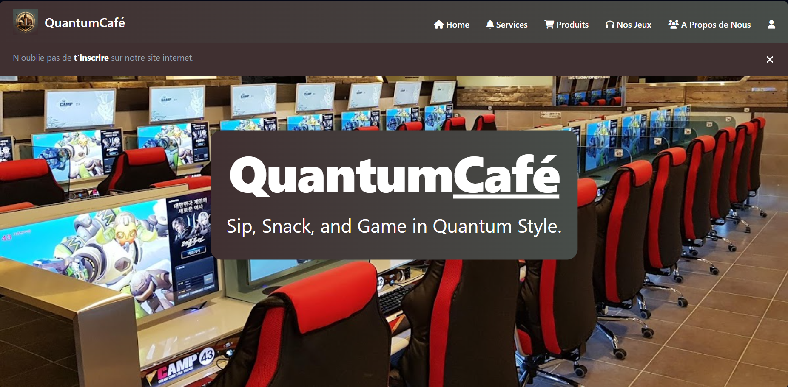
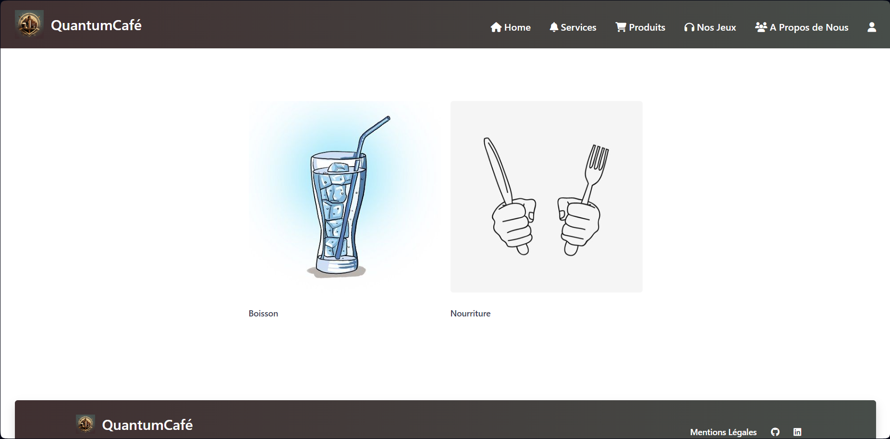
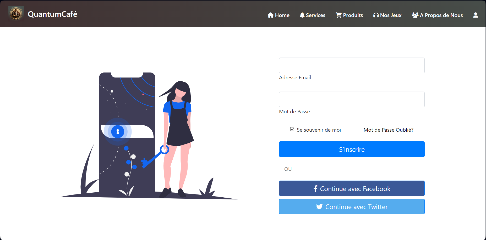

# QuantumCafé  
Bienvenue sur le dépôt GitHub de QuantumCafé, le site internet d'une entreprise fictive créer   pour mon AP1 du BTS SIO SLAM  

### Sommaire : 
• Énoncé 
• Images sur le site Internet 
• Tips 
 
AP-1 Création d’une entreprise virtuelle  
(Septembre – Février (1ère année de BTS)) 
  
### Outils :
  
• Travail collaboratif depuis un Trello, Google Drive, Teams, Slack, Jira…  
• Objectifs :  
1) Nom de l’entreprise  
2) Les valeurs de l’entreprise  
3) Création d’un logo pour votre entreprise  
▪ Typographie des documents (fonts)  
▪ La charte de graphique  
1) Imaginez un slogan pour votre entreprise  
2) Les produits, les solutions, ou les services proposés par votre entreprise  
3) Type d’organisme et son statut juridique : public, privé ou autre… / Statuts : SARL, SAS,  EURL, SA…  
4) Recherches : Conccurences, Étude de l'existant, Comparaison, Plus value, Faiblesses (exe : sous-effectif, sous dimenssionement des ressources humaines),  
5) Faire un petit buisness plan.  
6) Rôles : commercial, RH, technique, comptable, Directeur, président, etc.)  
7) Fiche de poste, KBIS  
8) Devis, facture, bon de command, calcul de budget (estimation prévisionnel)  
• Préaparer des diapositives de présentation avec tous les élements créer au auparavant.  
• Développement d’un site web pour votre entreprise [HTML+CSS+JS] (facultatif )  
• Référencer votre site sur les moteurs de recherches (SEO, LinkedIn...)  
 

## Ascpect du Site  

## Comment démarrer  
Pour lancer QuantumCafé localement, suivez ces étapes simples :  
  
1. Assurez-vous d'avoir [Visual Studio Code] installé sur votre machine.  

2. Installez [Live Server] sur [Visual Studio Code] et lancer le grâce au boutton "Go Live"  
